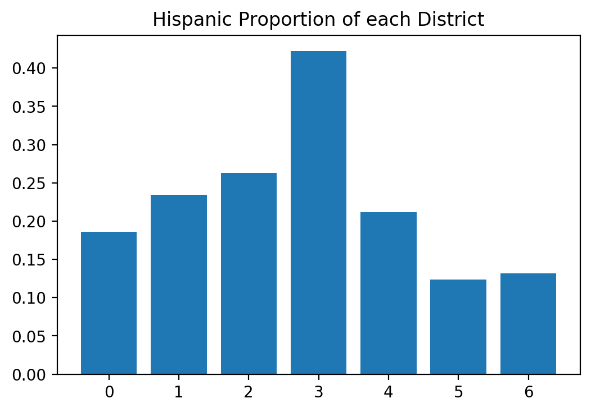
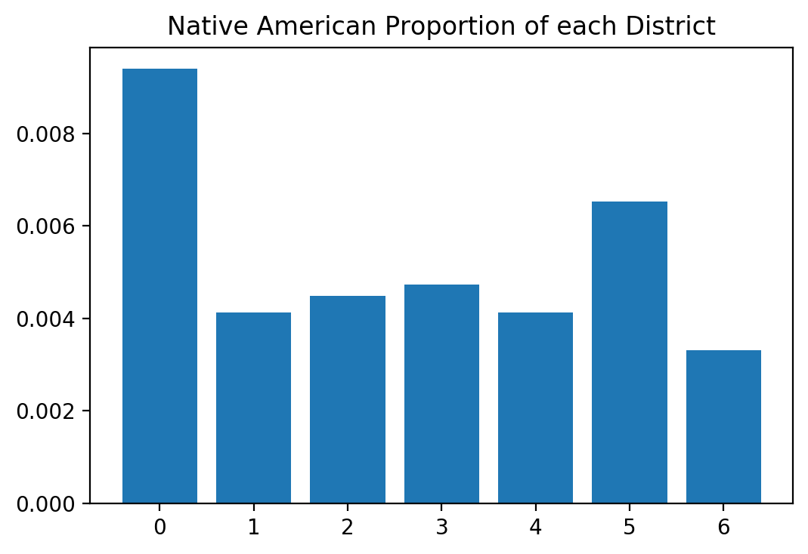
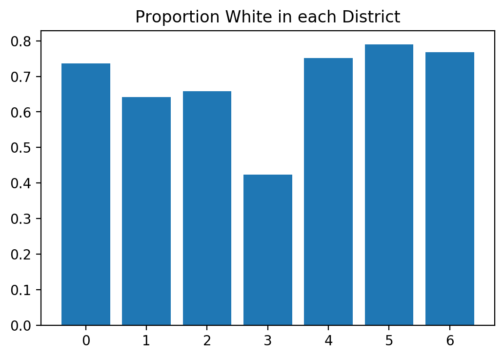

## Evaluating District Maps


```python
import os
import sys
sys.path.append(os.getcwd()) # needed for pweave--why?

import matplotlib.pyplot as plt
orig_backend = plt.get_backend()
import pysal as ps
plt.switch_backend(orig_backend)  #importing pysal seems to change backend

import numpy as np
import pandas as pd
import geopandas as gpd
import region
from helpers.objective_functionpopu import * 
from ballpark import business as human

from time import perf_counter as pfc

def loaddata(filename, url):
    if not(os.path.isfile('data/'+filename+'.geojson')):
        print("Retrieving the data and storing to a file")
        geodat = gpd.read_file(url)
        geodat.to_file('data/'+filename + '.geojson', driver='GeoJSON')
        geodat.to_file('data/'+filename)
    else:
        geodat = gpd.read_file('data/'+filename+'.geojson')
    #convert all to numeric where possible
    geodat = geodat.apply(pd.to_numeric, errors = 'ignore')
    #'pop' is not a good name for population
    if 'pop' in geodat.columns:
        geodat.rename({'pop':'population'}, axis = 'columns', inplace = True)

    return geodat
files = ['tracts', 'counties', 'districts']
urls = ['https://data.colorado.gov/resource/aevh-apr2.geojson?$limit=1300',
        'https://data.colorado.gov/resource/ewkj-ipn7.geojson',
        'https://data.colorado.gov/resource/jz4n-qus2.geojson']
urls = dict(zip(files, urls))
geodata = {eachfile: loaddata(eachfile, urls[eachfile]) for eachfile in files}
currdat = 'counties'

badcol = geodata['tracts'].columns[geodata['tracts'].isnull().any()]
racecat = [ 'hispanic', 'white_nh', 'black_nh', 'ntvam_nh',
            'asian_nh', 'hawpi_nh', 'other_nh', 'twoplus_nh']
# agecat = [i for i in geodata[currdat].columns if 'age' in i and i not in badcol]
# incomecat = []
# all income categories have some nans!
# educationcat = [i
#                 for i in geodata[currdat].columns
#                 if 'gr' in i and i not in badcol]
# educationcat.extend(['enrolled', 'n_enrolled'])

ndist = 7

def getpop(col, gdat = None, label = None):
    if gdat is None:
        gdat = geodata[currdat]
    if label is None:
        label = regdat[currdat].pair
    return [sum([gdat[col][i] for i in np.where(label == j)[0]])
            for j in range(1+int(max(label)))]

regdat = {eachfile : pd.read_csv('data/'+eachfile+'regions.csv')
 for eachfile in files[:2]}
```


With various algorithms and weight functions we can generate many
candidate maps.  In this section we will look at how well they satisfy
the criteria provided by law.  

The AZP regionalization optimizes for keeping racial and ethnic groups
from being divided.  Let's see populations by district to see how well
it does.


```python
regpops = getpop('population')
distpop = sum(geodata[currdat].population) / 7 
spanpops = getpop( 'hispanic')
whitepops = getpop('white_nh')
ntvpops = getpop('ntvam_nh')

f,ax = ([], [])
f[len(f):], ax[len(ax):] = tuple(zip(  plt.subplots(1)  ))
plt.bar(range(7),[i/(j+1) for (i,j) in zip(spanpops, regpops)])
ax[-1].set_title('Hispanic Proportion of each District')
f[-1].show()
```

```
/Library/Frameworks/Python.framework/Versions/3.7/bin/pweave:11:
UserWarning: Matplotlib is currently using
module://ipykernel.pylab.backend_inline, which is a non-GUI backend,
so cannot show the figure.
```

\


District 6 has a high proportion of
people who identify as hispanic, almost a majority.  In this
hypothetical districting map, any candidate would have to address the
concerns of this group.


```python
f[len(f):], ax[len(ax):] = tuple(zip(  plt.subplots(1)  ))
plt.bar(range(7),[i/(j+1) for (i,j) in zip(ntvpops, regpops)])
ax[-1].set_title("Native American Proportion of each District")
f[-1].show()
```

```
/Library/Frameworks/Python.framework/Versions/3.7/bin/pweave:4:
UserWarning: Matplotlib is currently using
module://ipykernel.pylab.backend_inline, which is a non-GUI backend,
so cannot show the figure.
  import sys
```

\


District 6 tends to maximize the
Native American population.  However it is a lower fraction of the
total population, and even in this district only comes to 
' 1%'.  
Even though this regionalization does have a region with high Native
population, their voting power is still diluted with other (mostly
white) groups'.


```python

f[len(f):], ax[len(ax):] = tuple(zip(  plt.subplots(1)  ))
pwhite =np.array([i/(j+1) for (i,j) in zip(whitepops, regpops)])
plt.bar(range(7),pwhite)
ax[-1].set_title("Proportion White in each District")
f[-1].show()
```

```
/Library/Frameworks/Python.framework/Versions/3.7/bin/pweave:5:
UserWarning: Matplotlib is currently using
module://ipykernel.pylab.backend_inline, which is a non-GUI backend,
so cannot show the figure.
```

\


For comparison here is the white population in each district.  Only in
District [] are they less than the
majority.
