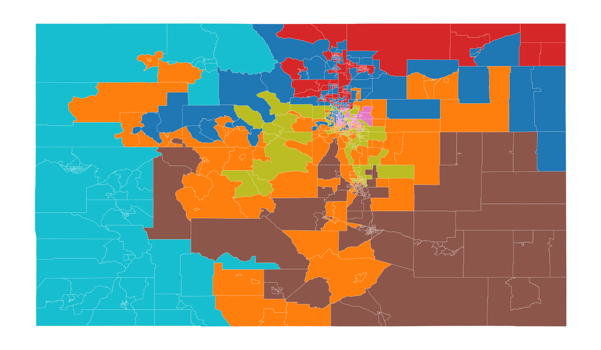
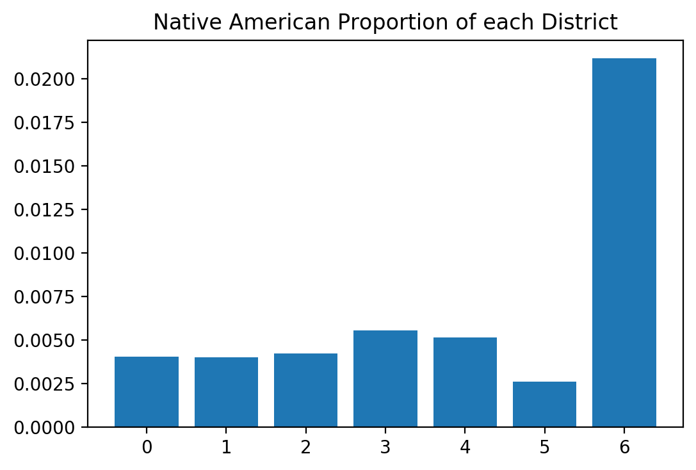

## Districts that preserve "communities of interest"
#### Loading libraries and data


First we import our libraries and load the data files. We'll use
census demographic data to quantify the community of interest. Keeping
the scope narrow, we'll just examine race and ethnicity, but income,
education level, or other indicators may be used.  We also load
current districts to evaluate how well they preserve communities of
interest.  When the redistricting commission produces new districts,
they may be evaluated, too.  Finally, we include census data by
county, which can validate our code more quickly because it has many
fewer areas to cluster.


```python

import os
import sys
sys.path.append(os.getcwd()) # needed for pweave--why?

import matplotlib.pyplot as plt
orig_backend = plt.get_backend()
import pysal as ps
plt.switch_backend(orig_backend)  #importing pysal seems to change backend

import numpy as np
import pandas as pd
import geopandas as gpd
import region
from helpers.objective_functionpopu import (
    ObjectiveFunctionComposite,
    ObjectiveFunctionBalance)
from ballpark import business as human

from time import perf_counter as pfc

def loaddata(filename, url):
    if not(os.path.isfile('data/'+filename+'.geojson')):
        print("Retrieving the data and storing to a file")
        geodat = gpd.read_file(url)
        geodat.to_file('data/'+filename + '.geojson', driver='GeoJSON')
        geodat.to_file('data/'+filename)
    else:
        geodat = gpd.read_file('data/'+filename+'.geojson')
    #convert all to numeric where possible
    geodat = geodat.apply(pd.to_numeric, errors = 'ignore')
    #'pop' is not a good name for population
    if 'pop' in geodat.columns:
        geodat.rename({'pop':'population'}, axis = 'columns', inplace = True)

    return geodat
files = ['tracts', 'counties', 'districts']
urls = ['https://data.colorado.gov/resource/aevh-apr2.geojson?$limit=1300',
        'https://data.colorado.gov/resource/ewkj-ipn7.geojson',
        'https://data.colorado.gov/resource/jz4n-qus2.geojson']
urls = dict(zip(files, urls))

geodata = {eachfile: loaddata(eachfile, urls[eachfile]) for eachfile in files}
```


The datasets are missing data; the medians sometimes not defined for a
tract.  For now we won't use columns without data and later go back
and deal with nans using perhaps `DataFrame.fillna()`.  To start we'll
limit our analysis to communnities of interest defined by race and
ethnicity.  

Working with the tracts data takes a lot of time because there are
1250 tracts and the algorithms are slow.  Setting the global variable
currdat to 'counties' lets us check the code quickly and then
resetting it to 'tracts' does what we want.


```python

currdat = 'tracts'

print('The following columns have nan elements')
badcol = geodata[currdat].columns[geodata[currdat].isnull().any()]
print(list(badcol))


racecat = [ 'hispanic', 'white_nh', 'black_nh', 'ntvam_nh',
            'asian_nh', 'hawpi_nh', 'other_nh', 'twoplus_nh']
#agecat = [i for i in geodata[currdat].columns if 'age' in i and i not in badcol]
#incomecat = []
#all income categories have some nans!
#educationcat = [i for i in geodata[currdat].columns if 'gr' in i and i not in badcol]
#educationcat.extend(['enrolled', 'n_enrolled'])

def getpop(col, gdat = geodata[currdat], label = None):
    if label is None:
        label = geodata[currdat].reg_azp
    return [sum([gdat[col][i] for i in np.where(label == j)[0]]) for j in range(1+int(max(gdat.reg_azp)))]
```

```
The following columns have nan elements
['med_age', 'med_fam_in', 'med_g_rent', 'avghhsize', 'med_hm_val',
'med_c_rent', 'med_hh_inc', 'med_yr_blt', 'per_cap_in']
```


### Generating District Maps

#### Max-p

First we'd like to answer the question "Where are the communities?"
The `max-p` algorithm divides a set of areas into regions with similar
characteristics.  The number of regions is not set, but is chosen by
the algorithm to optimize intra-region similarity.  It does require a
minimum value for each region, in this case we'll say that each region
requires at least 250,000 people, about 5% of the state.  

The maxp algorithm takes some time with the 1250 census tracts.  
We'll only do it if asked or if there's no prior saved file. 


```python

new_maxp = False

if new_maxp == True or 'reg_maxp' not in geodata[currdat].columns:

   print("Beginning maxp regionalization of "+currdat+ "...")
   maxp = region.max_p_regions.heuristics.MaxPRegionsHeu()
   maxp.fit_from_geodataframe(geodata[currdat], racecat,
                              'population', 500000, contiguity = 'queen')
   print("... done.")

   geodata[currdat]= geodata[currdat].assign(reg_maxp = maxp.labels_)
   
   geodata[currdat].to_file('data/'+currdat+'.geojson', driver = 'GeoJSON')


f = []
ax = []

f[len(f):], ax[len(ax):] = tuple(zip(  plt.subplots(1, figsize=(9, 9))  ))
geodata[currdat].plot(column='reg_maxp',
                      categorical=True,
                      linewidth=0.1,
                      edgecolor='white',
                      ax=ax[-1])
ax[-1].set_axis_off()


ndist = 7
```

{#Max P }\


Of course these cannot be congressional districts.  There must be only
7 districts, one for each seat Colorado has in the House of
Representatives.  


```python

f[len(f):], ax[len(ax):] = tuple(zip(  plt.subplots(1, figsize=(9, 9))  ))
geodata[currdat].plot(column='emp',
                      categorical=True,
                      linewidth=0.1,
                      edgecolor='white',
                      ax=ax[-1])
ax[-1].set_axis_off()
```

{#Current Districts }\


#### AZP

Now we will use the AZP algorithm to generate a specific number of
districts.  The algorithm optimizes an objective function, which in this
case includes intra-region similarity and total population.  


Now let's have a look at the output of the AZP regionalization of
Colorado's census tracts.

The AZP algorithm also takes some time with the 1250 census tracts.
The exact versions of these problems are np hard, and even the
heuristic takes a while.  Again we'll only do it if asked or if there
is no prior saved file.


```python

new_azp  = False
if new_azp == True or 'reg_azp' not in geodata[currdat].columns:

    pregazp = region.p_regions.azp.AZP()
    print("Beginning AZP regionalization of "+currdat+ "...")
 
    pregazp.fit_from_geodataframe(geodata[currdat], racecat, 
                                  ndist, contiguity = "queen", 
                                  objective_func = region.objective_function.ObjectiveFunctionPairwise()
                                  )
    print("... done.")
    
    geodata[currdat] = geodata[currdat].assign(reg_azp = pregazp.labels_)

    geodata[currdat].to_file('data/'+currdat+'.geojson', driver = 'GeoJSON')

f[len(f):], ax[len(ax):] = tuple(zip(  plt.subplots(1, figsize=(9, 9))  ))
geodata[currdat].plot(column='reg_azp',
                      categorical=True,
                      linewidth=0.1,
                      edgecolor='white',
                      ax=ax[-1])
ax[-1].set_axis_off()


regpops = getpop('population')
distpop = sum(geodata[currdat].population) / 7
```

{#AZP }\


These districts obviously show no regard for other criteria of
good congressional districts, like compactness, overlap with current
districts (below) or respect for natural features like mountains.
These could be included in the analysis by editing the objective
function.  In `helpers` we provide an objective function that composes
other objective functions.  

There is however, a bigger problem with this choice of regionalization.  The
law provides that each district be equal in population to within 5%.
> FIVE PERCENT DEVIATION TEST means that the sum of (a) the percent by
> which the largest district's population exceeds that of the ideal
> district and (b) the percent by which the smallest district's
> population falls short of the population of the ideal district, must
> be less than five percent. In re Reapportionment of
> Colo. Gen. Ass'y, 647 P.2d 191 (Colo. 1982).
In this case that means the population of each district must be close
to 776645.5714285715.  Since we don't include it in the objective function
our districts do not fillow this:


```python

print('The largest district is {0:2.0f}% above average'.format((max(regpops)/distpop -1)*100))
print('The smallest district is {0:2.0f}% below average'.format((1 - min(regpops)/distpop)*100))
```

```
The largest district is 14% above average
The smallest district is 18% below average
```


Equal populations is part of the goal of the regionalization analysis,
but it isn't included in the objective function.  In a later section
we'll use an objective function class from `helpers` that can compse
several objectives, including the need to balance population among
districts.
	
However, in the meantime the next section we work on evaluating the
regionalizations.

#### Evaluating District Maps

With various algorithms and weight functions we can generate many
candidate maps.  In this section we will look at how well they satisfy
the criteria provided by law.  


The AZP regionalization optimizes for keeping racial and ethnic groups
from being divided.  Let's see populations by district to see how well
it does.


```python

spanpops = getpop( 'hispanic')
whitepops = getpop('white_nh')
ntvpops = getpop('ntvam_nh')


f[len(f):], ax[len(ax):] = tuple(zip(  plt.subplots(1)  ))
plt.bar(range(7),[i/(j+1) for (i,j) in zip(spanpops, regpops)])
ax[-1].set_title('Hispanic Proportion of each District')
```

```
Text(0.5, 1.0, 'Hispanic Proportion of each District')
```

\


District 4 has a high proportion of
people who identify as hispanic, almost a majority.  In this
hypothetical districting map, any candidate would have to address the
concerns of this group.


```python
f[len(f):], ax[len(ax):] = tuple(zip(  plt.subplots(1)  ))
plt.bar(range(7),[i/(j+1) for (i,j) in zip(ntvpops, regpops)])
ax[-1].set_title("Native American Proportion of each District")
```

```
Text(0.5, 1.0, 'Native American Proportion of each District')
```

\


District 0 tends to maximize the
Native American population.  However it is a lower fraction of the
total population, and even in this district only comes to 
' 1%'.  
Even though this regionalization does have a region with high Native
population, their voting power is still diluted with other (mostly
white) groups'.


```python

f[len(f):], ax[len(ax):] = tuple(zip(  plt.subplots(1)  ))
pwhite =np.array([i/(j+1) for (i,j) in zip(whitepops, regpops)])
plt.bar(range(7),pwhite)
ax[-1].set_title("Proportion White in each District")
```

```
Text(0.5, 1.0, 'Proportion White in each District')
```

\


For comparison here is the white population in each district.  Only in
District [] are they less than the
majority.

#### Including multiple objectives

There are several objective functions provided by pysal, but there
isn't one that seeks to balance population among regions.  There also
is no way to include several objectives.  I modified pysal's 
`objective_function.py` to address this.  

ObjectiveFunctionBalance is merely the spread between the highest and
lowest total of the attribute.  ObjectiveFunctionComposite takes a
list of other objective functions, passes the same labels but
different attributes, receives the values, and combines them into one
overall result.  

Let's use these functions to generate a map that keeps race-based
communities of interest, but also places equal numbers in each
district.


```python

new_azp  = True
if new_azp == True or 'reg' not in geodata[currdat].columns:
    pregazp = region.p_regions.azp.AZP()
    func = ObjectiveFunctionComposite(
        [(ObjectiveFunctionBalance, ()),
         (region.objective_function.ObjectiveFunctionPairwise, ())],
        [['population'], racecat],
        [2,1]
    )        
    pregazp = region.p_regions.azp.AZP()

    print("Beginning AZP regionalization of "+currdat+ "...")
    pregazp.fit_from_geodataframe(geodata[currdat],
                                  func.flat_attr_list, 
                                  ndist,
                                  contiguity = "queen", 
                                  objective_func = func
                                  )
    print("... done.")
    
    geodata[currdat] = geodata[currdat].assign(reg = pregazp.labels_)

    geodata[currdat].to_file('data/'+currdat+'.geojson', driver = 'GeoJSON')


f[len(f):], ax[len(ax):] = tuple(zip(  plt.subplots(1, figsize=(9, 9))  ))
geodata[currdat].plot(column='reg',
                      categorical=True,
                      linewidth=0.1,
                      edgecolor='white',
                      ax=ax[-1])
ax[-1].set_axis_off()
```

```
Beginning AZP regionalization of tracts...
n_regions_per_comp {0: 7}
comp_label 0
n_regions_in_comp 7
Regions in comp: {0, 1, 2, 3, 4, 5, 6}
... done.
```

{#Composite }\


#### Future Work

We'll have to better weight the requirement of even populations in
order to have a map that passes muster.  In addition, we have a sense
of how well the regionalization preserves communities of interest, but
could we do better?  At what cost?  To answer that quantitatively, I'd
like to generate a set of random regionalizations and see where our
optimized regionalization ranks, both in variables that were optimized
and those that weren't.  This pseudo-p value will characterize how
different weightings of variables affect the final result.  

