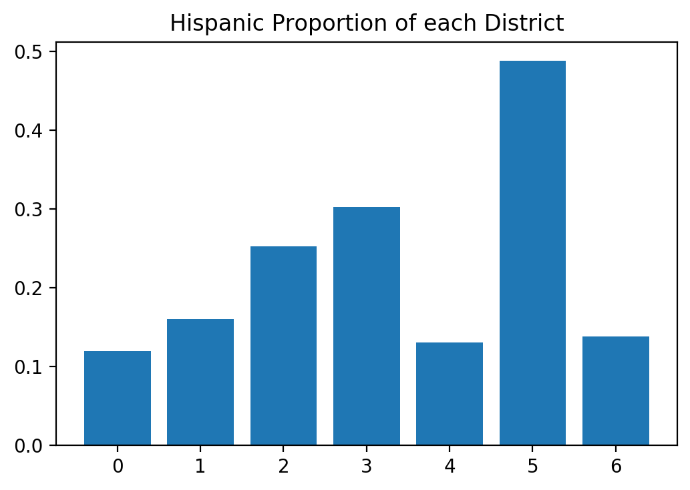

## Districts that preserve "communities of interest"

#### Loading libraries and data

First we import our libraries and load the data files.  We'll use
census demographic data to quantify the community of interest.
Keeping the scope narrow, we'll just examine race and ethnicity, but
income, education level, or other indicators may be used.  We also
load current districts to evaluate how well they preserve communities
of interest.  When the redistricting commission produces new
districts, they may be evaluated, too.  Finally, we include census
data by county, which can validate our code more quickly because it
has many fewer areas to cluster.  


```python
import os 
import pysal as ps
import matplotlib.pyplot as plt
import numpy as np
import pandas as pd
import geopandas as gpd
import region


def loaddata(filename, url):
    if not(os.path.isfile('data/'+filename+'.geojson')):
        print("Retrieving the data and storing to a file")
        geodat = gpd.read_file(url)
        geodat.to_file('data/'+filename + '.geojson', driver='GeoJSON')
        geodat.to_file('data/'+filename)
    else:
        geodat = gpd.read_file('data/'+filename)
    #convert all to numeric where possible
    geodat = geodat.apply(pd.to_numeric, errors = 'ignore')
    #'pop' is not a good name for population
    if 'pop' in geodat.columns:
        geodat.rename({'pop':'population'}, axis = 'columns', inplace = True)

    return geodat

files = ['tracts', 'counties', 'districts']
urls = ['https://data.colorado.gov/resource/aevh-apr2.geojson?$limit=1300',
        'https://data.colorado.gov/resource/ewkj-ipn7.geojson',
        'https://data.colorado.gov/resource/jz4n-qus2.geojson'] 

geodata = {eachfile: loaddata(eachfile, eachurl) for (eachfile, eachurl) in zip(files, urls)}
```


The datasets are missing data; the medians sometimes not defined for a
tract.  For now we won't use columns without data and later go back
and deal with nans using perhaps `DataFrame.fillna()`.  To start we'll
limit our analysis to communnities of interest defined by race and
ethnicity.  

Working with the tracts data takes a lot of time because there are
1250 tracts and the algorithms are slow.  Setting the global variable
currdat to 'counties' lets us check the code quickly and then
resetting it to 'tracts' does what we want.


```python
currdat = 'tracts'


print('The following columns have nan elements')
badcol = geodata[currdat].columns[geodata[currdat].isnull().any()]
print(list(badcol))


racecat = [ 'hispanic', 'white_nh', 'black_nh', 'ntvam_nh', 'asian_nh', 'hawpi_nh', 'other_nh', 'twoplus_nh']
#agecat = [i for i in geodata[currdat].columns if 'age' in i and i not in badcol]
#incomecat = []
#all income categories have some nans!
#educationcat = [i for i in geodata[currdat].columns if 'gr' in i and i not in badcol]
#educationcat.extend(['enrolled', 'n_enrolled'])
```

```
The following columns have nan elements
['med_age', 'med_fam_in', 'med_g_rent', 'avghhsize', 'med_hm_val',
'med_c_rent', 'med_hh_inc', 'med_yr_blt', 'per_cap_in']
```


### Generating District Maps

<!-- #### Max-p -->

<!-- First we'd like to answer the question "Where are the communities?" -->
<!-- The `max-p` algorithm divides a set of areas into regions with similar -->
<!-- characteristics.  The number of regions is not set, but is chosen by -->
<!-- the algorithm to optimize intra-region similarity.  It does require a -->
<!-- minimum value for each region, in this case we'll say that each region -->
<!-- requires at least 250,000 people, about 5% of the state.   -->

<!-- The maxp algorithm takes some time with the 1250 census tracts.   -->
<!-- We'll only do it if asked or if there's no prior saved file.  -->


<!-- ```python -->
<!-- new_maxp = False -->

<!-- if new_maxp == True or 'regindex_maxp' not in geodata[currdat].columns: -->

<!--    w = ps.queen_from_shapefile('data/'+currdat+'/'+currdat+'.shp', idVariable = 'geonum')   -->
<!--    z = geodata[currdat][racecat].values -->

<!--    print("Beginning maxp regionalization of "+currdat+ "...") -->
<!--    maxp = ps.region.Maxp(w, z, 500000 , geodata[currdat].population, initial=300) -->
<!--    print("... done.") -->

<!--    lbls = pd.Series(maxp.area2region).reindex(geodata[currdat]['geonum']).astype(str)    -->
<!--    geodata[currdat]= geodata[currdat].assign(regindex_maxp = lbls.values) -->
   
<!--    geodata[currdat].to_file('data/'+currdat) -->
   
   


<!-- f, ax = plt.subplots(1, figsize=(9, 9)) -->
<!-- geodata[currdat].assign(cl=lbls.values).plot(column='cl', -->
<!--                                      categorical=True, -->
<!--                                      linewidth=0.1, -->
<!--                                      edgecolor='white', -->
<!--                                      ax=ax) -->
<!-- ax.set_axis_off() -->
<!-- plt.show() -->
<!-- ``` -->

<!-- ``` -->
<!-- Beginning maxp regionalization of tracts... -->
<!-- ... done. -->
<!-- ``` -->

<!--  -->


<!-- Of course these cannot be congressional districts.  There must be only -->
<!-- 7 districts, one for each seat Colorado has in the House of -->
<!-- Representatives.  In addition, there must be close to equal population -->
<!-- in each district.  Here is how the current map does it. -->

For reference, here is how Colorado's current lines are drawn

```python

f2, ax2 = plt.subplots(1, figsize=(9, 9))
geodata['districts'].plot(column="emp",
       linewidth = .1, 
       categorical = True,
       edgecolor = 'white',
       ax=ax2)
ax2.set_axis_off()
```


#### AZP

Now we will use the AZP algorithm to generate seven districts, one for
each legislator Colorado is apportioned.  The algorithm optimizes an
objective function, which in this case includes intra-region
similarity and total population.


Now let's have a look at the output of the AZP regionalization of
Colorado's census tracts.


The AZP algorithm also takes some time with the 1250 census tracts.  
The exact versions of these problems are np hard, and even the heuristic
takes a while.  
We'll only do it if asked or if there is no prior saved file.  


```python

ndist = 7

new_azp = False

if new_azp == True or 'regindex_azp' not in geodata[currdat].columns:

    popweightfactor=1
    geodata[currdat].population = geodata[currdat].population*popweightfactor
    
    pregazp = region.p_regions.azp.AZP()
    print("Beginning AZP regionalization of "+currdat+ "...")
    pregazp.fit_from_geodataframe(geodata[currdat], ['population']+racecat, 
                                  ndist, contiguity = "queen", 
                                  objective_func = region.objective_function.ObjectiveFunctionPairwiseWithTotal() )
    print("... done.")
    geodata[currdat].population = geodata[currdat].population/popweightfactor
    
    geodata[currdat]= geodata[currdat].assign(regindex_azp = pregazp.labels_)
    
    geodata[currdat].to_file('data/'+currdat)
    
    

f1, ax1 = plt.subplots(1, figsize=(9,9))
geodata[currdat].plot(column = 'regindex_azp', 
       categorical = True, 
       linewidth = .1,
       edgecolor = 'white',
       legend = True,
       ax = ax1)
ax1.set_axis_off()
```

```
Beginning AZP regionalization of tracts...
n_regions_per_comp {0: 7}
comp_label 0
n_regions_in_comp 7
Regions in comp: {0, 1, 2, 3, 4, 5, 6}
... done.
```


These districts obviously show no regard for other criteria of good
congressional districts, like compactness, overlap with current
districts (below) or respect for natural features like mountains.
These could be included in the analysis by editing the objective
function.  In the next section we work on evaluating the regionalizations. 

#### Evaluating District Maps

With various algorithms and weight functions we can generate many
candidate maps.  In this section we will look at how well they satisfy
the criteria provided by law.  


The AZP regionalization optimizes for keeping racial and ethnic groups
from being divided.  Let's see populations by district to see how well
it does.


```python
regpops = [sum([geodata[currdat].population[i] for i in np.where(geodata[currdat].regindex_azp == j)[0]]) for j in range(7)]
spanpops= [sum([geodata[currdat].hispanic[i] for i in np.where(geodata[currdat].regindex_azp == j)[0]]) for j in range(7)]
whitepops = [sum([geodata[currdat].white_nh[i] for i in np.where(geodata[currdat].regindex_azp == j)[0]]) for j in range(7)]
ntvpops= [sum([geodata[currdat].ntvam_nh[i] for i in np.where(geodata[currdat].regindex_azp == j)[0]]) for j in range(7)]
```


```python
f3, ax3 = plt.subplots(1)
plt.bar(range(7),[i/(j+1) for (i,j) in zip(spanpops, regpops)])
ax3.set_title('Hispanic Proportion of each District')
```

```
Text(0.5, 1.0, 'Hispanic Proportion of each District')
```




District 5 has a high proportion of people who identify as hispanic.
In this hypothetical districting map, any candidate would have to
address the concerns of this group.


```python
f4, ax4 = plt.subplots(1)
plt.bar(range(7),[i/(j+1) for (i,j) in zip(ntvpops, regpops)])
ax4.set_title("Native American Proportion of each District")
```

```
Text(0.5, 1.0, 'Native American Proportion of each District')
```


District 6 tends to maximize the Native American population.  However
it is a lower fraction of the total population, so even in this
district only comes to 1%.  Even though this regionalization does have
a region with high Native population, their voting power is still
diluted with other (mostly white) groups'.


```python
f5, ax5 = plt.subplots(1)
plt.bar(range(7),[i/(j+1) for (i,j) in zip(whitepops, regpops)])
ax5.set_title("Proportion White in each District")
```

```
Text(0.5, 1.0, 'Proportion White in each District')
```


For comparison here is the white population in each district.  Only in
District 5 are they less than the majority.

The law provides that each district be equal in population to within
5%.
> FIVE PERCENT DEVIATION TEST means that the sum of (a) the percent by
> which the largest district's population exceeds that of the ideal
> district and (b) the percent by which the smallest district's
> population falls short of the population of the ideal district, must
> be less than five percent. In re Reapportionment of
> Colo. Gen. Ass'y, 647 P.2d 191 (Colo. 1982).
These districts pass this test:


```python
distpop = sum(regpops)/7
print('The largest district is ', max(regpops)/distpop -1, " above average")
print('The smallest district is ', 1-min(regpops)/distpop, " below average")
```

```
The largest district is  0.0011786954115307058  above average
The smallest district is  0.0021947867744047667  below average
```


#### Future Work

Clearly, more criteria need to be included in the optimization, most
pressingly compactness.  No one would accept these lines, even though
they are technically legal.  

Also we have a sense of how well the regionalization preserves
communities of interest, but could we do better?  At what cost to the
other optimization critera?  Is there a map that, for instance, gives
a majority hispanic district, and how much would it sacrifice on other
critera?  To answer that quantitatively, I'd like to generate a set of
random regionalizations and see where our optimized regionalization
ranks, both in variables that were optimized and those that weren't.
This pseudo-p value will characterize how different weightings of
variables affect the final result.  
