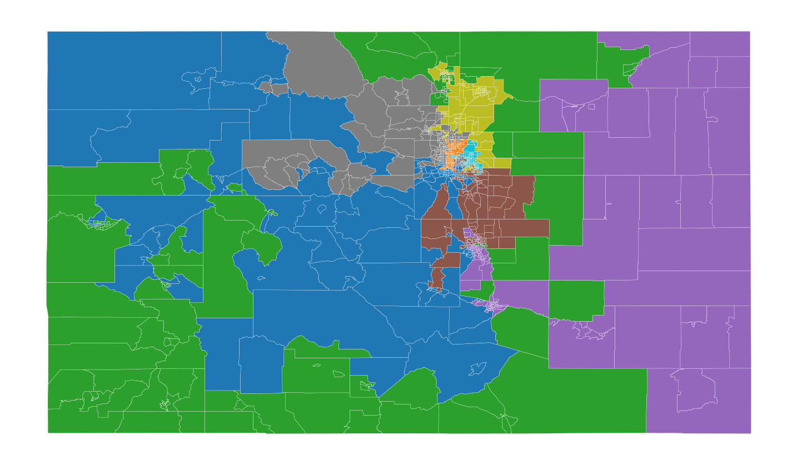
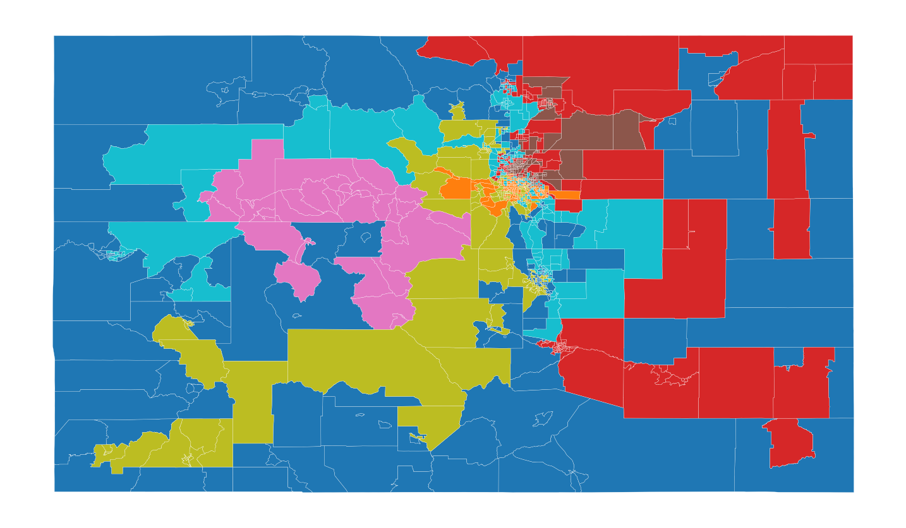

## Regionalization Analysis
#### Preserving "Communities of Interest"


#### Loading files

First we import our libraries and load the data files. We'll use
census demographic data to quantify the community of interest. Keeping
the scope narrow, we'll just examine race and ethnicity, but income,
education level, or other indicators may be used.  We also load
current districts to evaluate how well they preserve communities of
interest.  When the redistricting commission produces new districts,
they may be evaluated, too.  Finally, working with the tracts data
takes a lot of time because there are 1250 tracts and the algorithms
are slow.  Setting the global variable currdat to 'counties' lets us
check the code quickly and then resetting it to 'tracts' does what we
want.

The initialization code is at 
[helpers/__init__.py](./blob/master/helpers/__init__.py)


```python
import os
import sys
sys.path.append(os.getcwd()) # needed for pweave--why?

import matplotlib.pyplot as plt
orig_backend = plt.get_backend()
import pysal as ps
plt.switch_backend(orig_backend)  #importing pysal seems to change backend

import numpy as np
import pandas as pd
import geopandas as gpd
import region
from helpers.objective_functionpopu import * 
from ballpark import business as human

from time import perf_counter as pfc

def loaddata(filename, url):
    if not(os.path.isfile('data/'+filename+'.geojson')):
        print("Retrieving the data and storing to a file")
        geodat = gpd.read_file(url)
        geodat.to_file('data/'+filename + '.geojson', driver='GeoJSON')
        geodat.to_file('data/'+filename)
    else:
        geodat = gpd.read_file('data/'+filename+'.geojson')
    #convert all to numeric where possible
    geodat = geodat.apply(pd.to_numeric, errors = 'ignore')
    #'pop' is not a good name for population
    if 'pop' in geodat.columns:
        geodat.rename({'pop':'population'}, axis = 'columns', inplace = True)

    return geodat
files = ['tracts', 'counties', 'districts']
urls = ['https://data.colorado.gov/resource/aevh-apr2.geojson?$limit=1300',
        'https://data.colorado.gov/resource/ewkj-ipn7.geojson',
        'https://data.colorado.gov/resource/jz4n-qus2.geojson']
urls = dict(zip(files, urls))
geodata = {eachfile: loaddata(eachfile, urls[eachfile]) for eachfile in files}
currdat = 'tracts'

badcol = geodata['tracts'].columns[geodata['tracts'].isnull().any()]
racecat = [ 'hispanic', 'white_nh', 'black_nh', 'ntvam_nh',
            'asian_nh', 'hawpi_nh', 'other_nh', 'twoplus_nh']
# agecat = [i for i in geodata[currdat].columns if 'age' in i and i not in badcol]
# incomecat = []
# all income categories have some nans!
# educationcat = [i
#                 for i in geodata[currdat].columns
#                 if 'gr' in i and i not in badcol]
# educationcat.extend(['enrolled', 'n_enrolled'])

ndist = 7

def getpop(col, gdat = None, label = None):
    if gdat is None:
        gdat = geodata[currdat]
    if label is None:
        label = geodata[currdat].reg_azp
    return [sum([gdat[col][i] for i in np.where(label == j)[0]])
            for j in range(1+int(max(gdat.reg_azp)))]

regdat = {eachfile : pd.read_csv('data/'+eachfile+'regions.csv')
 for eachfile in files[:2]}
```


The datasets are missing data; the medians sometimes not defined for a
tract.  For now we won't use columns without data and later go back
and deal with nans using perhaps `DataFrame.fillna()`.  To start we'll
limit our analysis to communnities of interest defined by race and
ethnicity.  


```python
print('The following columns have nan elements')
print(list(badcol))
```

```
The following columns have nan elements
['med_age', 'med_fam_in', 'med_g_rent', 'avghhsize', 'med_hm_val',
'med_c_rent', 'med_hh_inc', 'med_yr_blt', 'per_cap_in']
```


### Generating District Maps

#### Max-p

First we'd like to answer the question "Where are the communities?"
The `max-p` algorithm divides a set of areas into regions with similar
characteristics.  The number of regions is not set, but is chosen by
the algorithm to optimize intra-region similarity.  It does require a
minimum value for each region, in this case we'll say that each region
requires at least 250,000 people, about 5% of the state.  

The maxp algorithm takes some time with the 1250 census tracts.  
We'll only do it if asked or if there's no prior saved file. 


```python

new_maxp = False

if new_maxp == True or 'maxp' not in regdat[currdat].columns:

   print("Beginning maxp regionalization of "+currdat+ "...")
   maxp = region.max_p_regions.heuristics.MaxPRegionsHeu()
   maxp.fit_from_geodataframe(geodata[currdat], racecat,
                              'population', 500000, contiguity = 'queen')
   print("... done.")

   regdat[currdat] = regdat[currdat].assign(maxp = pregazp.labels_)
   regdat[currdat].to_csv('data/'+currdat+'regions.csv', index = False)

f = []
ax = []

f[len(f):], ax[len(ax):] = tuple(zip(  plt.subplots(1, figsize=(9, 9))  ))
geodata[currdat]['labels'] = regdat[currdat]['maxp']
geodata[currdat].plot(column='labels',
                      categorical=True,
                      linewidth=0.1,
                      edgecolor='white',
                      ax=ax[-1])
ax[-1].set_axis_off()
```

{#Max P }\


Of course these cannot be congressional districts.  There must be only
7 districts, one for each seat Colorado has in the House of
Representatives.  


```python

f[len(f):], ax[len(ax):] = tuple(zip(  plt.subplots(1, figsize=(9, 9))  ))
geodata['districts'].plot(column='emp',
                      categorical=True,
                      linewidth=0.1,
                      edgecolor='white',
                      ax=ax[-1])
ax[-1].set_axis_off()
```

{#Current Districts }\


#### Demographic Data Only

Now we will use the AZP algorithm to generate a specific number of
districts.  The algorithm optimizes an objective function, which in
this case includes intra-region similarity and total population.
Let's have a look at the output of the AZP regionalization of
Colorado's census tracts.

The AZP algorithm also takes some time with the 1250 census tracts.
The exact versions of these problems are np hard, and even the
heuristic takes a while.  Again we'll only do it if asked or if there
is no prior saved file.


```python

new_azp  = False
if new_azp == True or 'pair' not in regdat[currdat].columns:

    pregazp = region.p_regions.azp.AZP()
    print("Beginning AZP regionalization of "+currdat+ "...")
 
    pregazp.fit_from_geodataframe(geodata[currdat], racecat, 
                                  ndist, contiguity = "queen", 
                                  objective_func = ObjectiveFunctionPairwise()
                                  )
    print("... done.")
    
    regdat[currdat] = regdat[currdat].assign(pair = pregazp.labels_)
    regdat[currdat].to_csv('data/'+currdat+'regions.csv', index = False)

f[len(f):], ax[len(ax):] = tuple(zip(  plt.subplots(1, figsize=(9, 9))  ))
geodata[currdat]['labels'] = regdat[currdat]['pair']
geodata[currdat].plot(column='labels',
                      categorical=True,
                      linewidth=0.1,
                      edgecolor='white',
                      ax=ax[-1])
ax[-1].set_axis_off()


regpops = getpop('population')
distpop = sum(geodata[currdat].population) / 7
```

{#AZP }\


These districts obviously show no regard for other criteria of
good congressional districts, like compactness, overlap with current
districts (below) or respect for natural features like mountains.
These could be included in the analysis by editing the objective
function.  In `helpers` we provide an objective function that composes
other objective functions.  

There is however, a bigger problem with this choice of regionalization.  The
law provides that each district be equal in population to within 5%.
> FIVE PERCENT DEVIATION TEST means that the sum of (a) the percent by
> which the largest district's population exceeds that of the ideal
> district and (b) the percent by which the smallest district's
> population falls short of the population of the ideal district, must
> be less than five percent. In re Reapportionment of
> Colo. Gen. Ass'y, 647 P.2d 191 (Colo. 1982).
In this case that means the population of each district must be close
to 776645.5714285715.  Since we don't include it in the objective function
our districts do not fillow this:


```python

print('The largest district is {0:2.0f}% above average'.format((max(regpops)/distpop -1)*100))
print('The smallest district is {0:2.0f}% below average'.format((1 - min(regpops)/distpop)*100))
```

```
The largest district is 68% above average
The smallest district is 78% below average
```


Equal populations is part of the goal of the regionalization analysis,
but it isn't included in the objective function.  In a later section
we'll use an objective function class from `helpers` that can compse
several objectives, including the need to balance population among
districts.

#### Including multiple objectives

There are several objective functions provided by pysal, but there
isn't one that seeks to balance population among regions.  There also
is no way to include several objectives.  I modified pysal's 
`objective_function.py` to address this.  

`ObjectiveFunctionBalance` is merely the spread between the highest and
lowest total of the attribute.  `ObjectiveFunctionComposite` takes a
list of other objective functions, passes the same labels but
different attributes, receives the values, and combines them into one
overall result.  

Let's use these functions to generate a map that keeps race-based
communities of interest, but also places equal numbers in each
district.

`ObjectiveFunctionComposite` allows weighting each different
sub-objective. To make values from each sub-objective comensurate,
we'll scale each, by dividing by the `natural_weight`, a typical value
of the objective function.  


```python

flist = [ObjectiveFunctionBalance,
         ObjectiveFunctionPairwise
]
attlist = [['population'], racecat]

def make_weight(functions, attributes):
    iter = (1/
            (f().natural_weight(region.util.array_from_df_col(geodata[currdat], at)))
            for (f, at)
            in zip(functions, attributes))
    return  np.fromiter(iter, float)

w0 = make_weight(flist, attlist)

new_azp  = False
if new_azp == True or 'pair_bal' not in regdat[currdat].columns:
    pregazp = region.p_regions.azp.AZP()
    func = ObjectiveFunctionComposite(flist, attlist, w0)        
    pregazp = region.p_regions.azp.AZP()

    print("Beginning AZP regionalization of "+currdat+ "...")
    pregazp.fit_from_geodataframe(geodata[currdat],
                                  func.flat_attr_list, 
                                  ndist,
                                  contiguity = "queen", 
                                  objective_func = func
                                  )
    print("... done.")

    regdat[currdat] = regdat[currdat].assign(pair_bal = pregazp.labels_)
    regdat[currdat].to_csv('data/'+currdat+'regions.csv', index = False)

f[len(f):], ax[len(ax):] = tuple(zip(  plt.subplots(1, figsize=(9, 9))  ))
                                                             
geodata[currdat]['labels'] = regdat[currdat]['pair_bal']
geodata[currdat].plot(column='labels',
                      categorical=True,
                      linewidth=0.1,
                      edgecolor='white',
                      ax=ax[-1])
ax[-1].set_axis_off()
```

```
---------------------------------------------------------------------------KeyboardInterrupt
Traceback (most recent call last)<ipython-input-1-ebf4cf81c8ad> in
<module>
     11     return  np.fromiter(iter, float)
     12
---> 13 w0 = make_weight(flist, attlist)
     14
     15 new_azp  = False
<ipython-input-1-ebf4cf81c8ad> in make_weight(functions, attributes)
      9             for (f, at)
     10             in zip(functions, attributes))
---> 11     return  np.fromiter(iter, float)
     12
     13 w0 = make_weight(flist, attlist)
<ipython-input-1-ebf4cf81c8ad> in <genexpr>(.0)
      7     iter = (1/
      8
(f().natural_weight(region.util.array_from_df_col(geodata[currdat],
at)))
----> 9             for (f, at)
     10             in zip(functions, attributes))
     11     return  np.fromiter(iter, float)
/Volumes/LEON/Community/helpers/objective_functionpopu.py in
natural_weight(self, attr, ndist)
     99
    100     def natural_weight(self, attr, ndist = 7):
--> 101         return self(np.zeros(attr.shape[0]), attr)/ndist
    102         #/ len(l1)**2 * (len(l1)/ndist)**2 * ndist ,
    103         #per pair       number of pairs per dist   districts
/Volumes/LEON/Community/helpers/objective_functionpopu.py in
__call__(self, labels, attr)
     80         obj_val = sum(
     81             self.metric(attr[i].reshape(1, -1),
attr[j].reshape(1, -1))
---> 82             for r in regions_set
     83             for i, j in itertools.combinations(np.where(labels
== r)[0], 2))
     84
/Volumes/LEON/Community/helpers/objective_functionpopu.py in
<genexpr>(.0)
     81             self.metric(attr[i].reshape(1, -1),
attr[j].reshape(1, -1))
     82             for r in regions_set
---> 83             for i, j in itertools.combinations(np.where(labels
== r)[0], 2))
     84
     85         return float(obj_val)
/Library/Frameworks/Python.framework/Versions/3.7/lib/python3.7/site-
packages/sklearn/metrics/pairwise.py in manhattan_distances(X, Y,
sum_over_features)
    630            [1., 1.]])
    631     """
--> 632     X, Y = check_pairwise_arrays(X, Y)
    633
    634     if issparse(X) or issparse(Y):
/Library/Frameworks/Python.framework/Versions/3.7/lib/python3.7/site-
packages/sklearn/metrics/pairwise.py in check_pairwise_arrays(X, Y,
precomputed, dtype)
    110     else:
    111         X = check_array(X, accept_sparse='csr', dtype=dtype,
--> 112                         estimator=estimator)
    113         Y = check_array(Y, accept_sparse='csr', dtype=dtype,
    114                         estimator=estimator)
/Library/Frameworks/Python.framework/Versions/3.7/lib/python3.7/site-
packages/sklearn/utils/validation.py in check_array(array,
accept_sparse, accept_large_sparse, dtype, order, copy,
force_all_finite, ensure_2d, allow_nd, ensure_min_samples,
ensure_min_features, warn_on_dtype, estimator)
    540         if force_all_finite:
    541             _assert_all_finite(array,
--> 542                                allow_nan=force_all_finite ==
'allow-nan')
    543
    544     if ensure_min_samples > 0:
/Library/Frameworks/Python.framework/Versions/3.7/lib/python3.7/site-
packages/sklearn/utils/validation.py in _assert_all_finite(X,
allow_nan)
     47     # safely to reduce dtype induced overflows.
     48     is_float = X.dtype.kind in 'fc'
---> 49     if is_float and (np.isfinite(_safe_accumulator_op(np.sum,
X))):
     50         pass
     51     elif is_float:
/Library/Frameworks/Python.framework/Versions/3.7/lib/python3.7/site-
packages/sklearn/utils/extmath.py in _safe_accumulator_op(op, x,
*args, **kwargs)
    686         result = op(x, *args, **kwargs, dtype=np.float64)
    687     else:
--> 688         result = op(x, *args, **kwargs)
    689     return result
    690
<__array_function__ internals> in sum(*args, **kwargs)
/Library/Frameworks/Python.framework/Versions/3.7/lib/python3.7/site-
packages/numpy/core/fromnumeric.py in sum(a, axis, dtype, out,
keepdims, initial, where)
   2180
   2181     return _wrapreduction(a, np.add, 'sum', axis, dtype, out,
keepdims=keepdims,
-> 2182                           initial=initial, where=where)
   2183
   2184
/Library/Frameworks/Python.framework/Versions/3.7/lib/python3.7/site-
packages/numpy/core/fromnumeric.py in _wrapreduction(obj, ufunc,
method, axis, dtype, out, **kwargs)
     88                 return reduction(axis=axis, out=out,
**passkwargs)
     89
---> 90     return ufunc.reduce(obj, axis, dtype, out, **passkwargs)
     91
     92
KeyboardInterrupt:
```


The districts still aren't balanced that well.  The largest district is 
'68%' 
larger than average, and the smallest is 
'78%'
smaller.  

#### Including compactness

The districts shown so far are absurd because they snake all around,
just like Gerry's salamander.  Now let's include compactness in the
objective by providing a compactness function that measures perimeter
of the districts.  


```python

flist.append(ObjectiveFunctionCompactness)
attlist.append(['geometry'])
w0 = make_weight(flist, attlist)

if new_azp == True or 'pair_bal_pact' not in regdat[currdat].columns:
    pregazp = region.p_regions.azp.AZP()
    func = ObjectiveFunctionComposite(flist, attlist, w0)

    pregazp.fit_from_geodataframe(geodata[currdat],
                                  func.flat_attr_list,
                                  ndist,
                                  contiguity = 'queen',
                                  objective_func = func
    )

    regdat[currdat] = regdat[currdat].assign(pair_bal_pact = pregazp.labels_)
    regdat[currdat].to_csv('data/'+currdat+'regions.csv', index = False)

f[len(f):], ax[len(ax):] = tuple(zip(  plt.subplots(1, figsize=(9, 9))  ))
geodat[currdat]['labels'] = regdat[currdat]['pair_bal_pact']
geodat[currdat].plot(column='labels',
                     categorical=True,
                     linewidth=0.1,
                     edgecolor='white',
                     ax=ax[-1])
ax[-1].set_axis_off()
```

```
---------------------------------------------------------------------------KeyboardInterrupt
Traceback (most recent call last)<ipython-input-1-d001aed16e61> in
<module>
      1 flist.append(ObjectiveFunctionCompactness)
      2 attlist.append(['geometry'])
----> 3 w0 = make_weight(flist, attlist)
      4
      5 if new_azp == True or 'pair_bal_pact' not in
regdat[currdat].columns:
<ipython-input-1-ebf4cf81c8ad> in make_weight(functions, attributes)
      9             for (f, at)
     10             in zip(functions, attributes))
---> 11     return  np.fromiter(iter, float)
     12
     13 w0 = make_weight(flist, attlist)
<ipython-input-1-ebf4cf81c8ad> in <genexpr>(.0)
      7     iter = (1/
      8
(f().natural_weight(region.util.array_from_df_col(geodata[currdat],
at)))
----> 9             for (f, at)
     10             in zip(functions, attributes))
     11     return  np.fromiter(iter, float)
/Volumes/LEON/Community/helpers/objective_functionpopu.py in
natural_weight(self, attr, ndist)
     99
    100     def natural_weight(self, attr, ndist = 7):
--> 101         return self(np.zeros(attr.shape[0]), attr)/ndist
    102         #/ len(l1)**2 * (len(l1)/ndist)**2 * ndist ,
    103         #per pair       number of pairs per dist   districts
/Volumes/LEON/Community/helpers/objective_functionpopu.py in
__call__(self, labels, attr)
     80         obj_val = sum(
     81             self.metric(attr[i].reshape(1, -1),
attr[j].reshape(1, -1))
---> 82             for r in regions_set
     83             for i, j in itertools.combinations(np.where(labels
== r)[0], 2))
     84
/Volumes/LEON/Community/helpers/objective_functionpopu.py in
<genexpr>(.0)
     81             self.metric(attr[i].reshape(1, -1),
attr[j].reshape(1, -1))
     82             for r in regions_set
---> 83             for i, j in itertools.combinations(np.where(labels
== r)[0], 2))
     84
     85         return float(obj_val)
/Library/Frameworks/Python.framework/Versions/3.7/lib/python3.7/site-
packages/sklearn/metrics/pairwise.py in manhattan_distances(X, Y,
sum_over_features)
    630            [1., 1.]])
    631     """
--> 632     X, Y = check_pairwise_arrays(X, Y)
    633
    634     if issparse(X) or issparse(Y):
/Library/Frameworks/Python.framework/Versions/3.7/lib/python3.7/site-
packages/sklearn/metrics/pairwise.py in check_pairwise_arrays(X, Y,
precomputed, dtype)
    112                         estimator=estimator)
    113         Y = check_array(Y, accept_sparse='csr', dtype=dtype,
--> 114                         estimator=estimator)
    115
    116     if precomputed:
/Library/Frameworks/Python.framework/Versions/3.7/lib/python3.7/site-
packages/sklearn/utils/validation.py in check_array(array,
accept_sparse, accept_large_sparse, dtype, order, copy,
force_all_finite, ensure_2d, allow_nd, ensure_min_samples,
ensure_min_features, warn_on_dtype, estimator)
    540         if force_all_finite:
    541             _assert_all_finite(array,
--> 542                                allow_nan=force_all_finite ==
'allow-nan')
    543
    544     if ensure_min_samples > 0:
/Library/Frameworks/Python.framework/Versions/3.7/lib/python3.7/site-
packages/sklearn/utils/validation.py in _assert_all_finite(X,
allow_nan)
     47     # safely to reduce dtype induced overflows.
     48     is_float = X.dtype.kind in 'fc'
---> 49     if is_float and (np.isfinite(_safe_accumulator_op(np.sum,
X))):
     50         pass
     51     elif is_float:
/Library/Frameworks/Python.framework/Versions/3.7/lib/python3.7/site-
packages/sklearn/utils/extmath.py in _safe_accumulator_op(op, x,
*args, **kwargs)
    683     result : The output of the accumulator function passed to
this function
    684     """
--> 685     if np.issubdtype(x.dtype, np.floating) and
x.dtype.itemsize < 8:
    686         result = op(x, *args, **kwargs, dtype=np.float64)
    687     else:
/Library/Frameworks/Python.framework/Versions/3.7/lib/python3.7/site-
packages/numpy/core/numerictypes.py in issubdtype(arg1, arg2)
    390
    391     """
--> 392     if not issubclass_(arg1, generic):
    393         arg1 = dtype(arg1).type
    394     if not issubclass_(arg2, generic):
KeyboardInterrupt:
```


#### Future Work

We'll have to better weight the requirement of even populations in
order to have a map that passes muster.  In addition, we have a sense
of how well the regionalization preserves communities of interest, but
could we do better?  At what cost?  To answer that quantitatively, I'd
like to generate a set of random regionalizations and see where our
optimized regionalization ranks, both in variables that were optimized
and those that weren't.  This pseudo-p value will characterize how
different weightings of variables affect the final result.  

